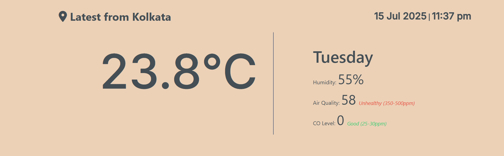
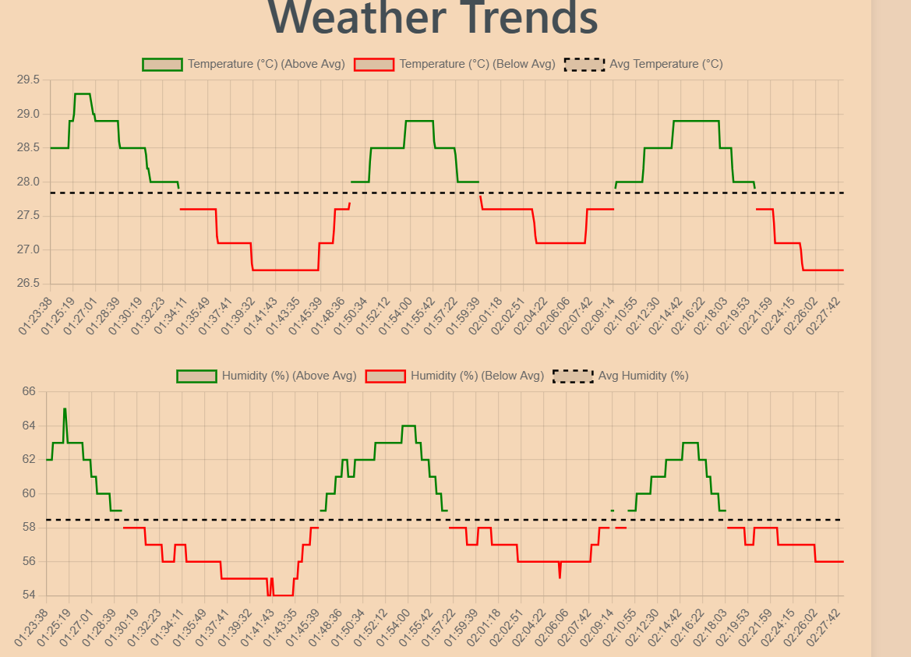
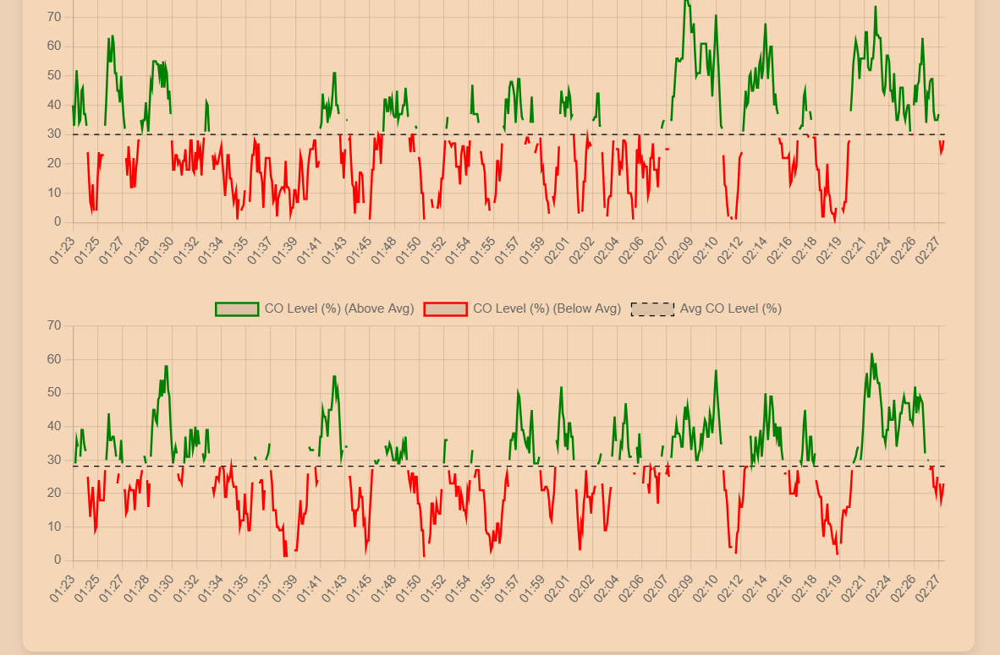
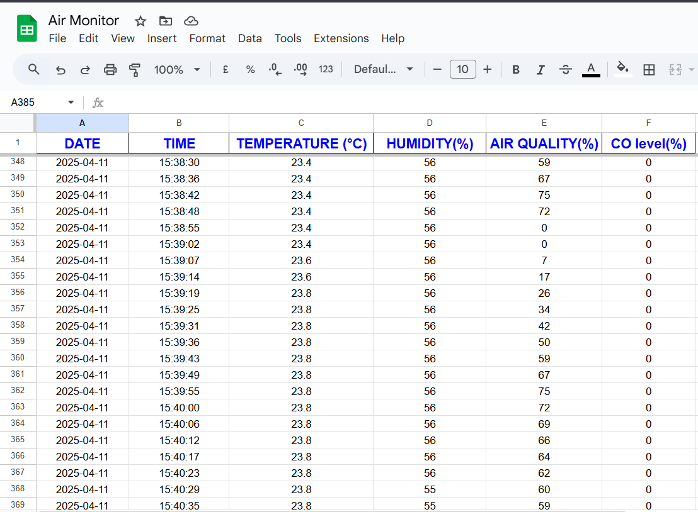

# Drone Air Monitor 🚁💨

[](https://opensource.org/licenses/MIT)
[]()
[](http://makeapullrequest.com)

A comprehensive solution for real-time air quality monitoring using a fleet of drones. This application provides a platform to visualize data, manage drones, and analyze historical air quality trends.

---

## 📋 Table of Contents

- [About The Project](#-about-the-project)
  - [Built With](#built-with)
- [✨ Features](#-features)
- [📸 Screenshots](#-screenshots)
- [🚀 Getting Started](#-getting-started)
  - [Prerequisites](#prerequisites)
  - [Installation](#installation)
- [🔧 Usage](#-usage)
- [🤝 Contributing](#-contributing)
- [📝 License](#-license)
- [🙏 Acknowledgements](#-acknowledgements)

---

## ℹ️ About The Project

Drone Air Monitor is a full-stack application designed to tackle the challenge of localized air pollution monitoring. Traditional monitoring stations are stationary and provide limited coverage. By leveraging a fleet of drones, this project aims to provide dynamic, high-resolution air quality data from various locations and altitudes.

This project consists of:
*   A **web-based dashboard** for real-time visualization and control.
*   A **backend server** to handle data ingestion from drones, and API services.
*   A **communication protocol** for drones to send data securely and efficiently.

### Built With


*   **Frontend:**
    *   [React.js](https://reactjs.org/)
    *   [Mapbox](https://www.mapbox.com/)
    *   [Chart.js](https://www.chartjs.org/)
*   **Backend:**
    *   [Node.js](https://nodejs.org/)
    *   [Maps API](https://console.cloud.google.com/)

---

## ✨ Features

*   **Real-time Map Visualization:** Track drones and view live air quality data (e.g., CO, NO2, PM2.5) on an interactive map.
*   **Historical Data Analysis:** View and export historical data with charts and graphs to identify pollution trends.
*   **Responsive Dashboard:** A clean and modern UI that works on both desktop and mobile devices.

---

## 📸 Screenshots

Here are some screenshots of the application in action.
<td align="center" valign="top"></td>
<table align="center">
<tr>
    <td align="center" valign="top"></td>
    <td align="center" valign="top"></td>
  </tr>
</table>
<td align="center" valign="top"></td>

---

## 🚀 Getting Started

To get a local copy up and running, follow these simple steps.

### Prerequisites

Make sure you have the following software installed on your machine:

*   Node.js (which includes npm)
*   Git

### Installation

1.  **Clone the repository**
    ```sh
    git clone https://github.com/your_username/DroneAirMonitor.git
    cd DroneAirMonitor
    ```

2.  **Inside a terminal**
    ```node
    node server.js
    ```
    The application should open automatically in your browser at `http://localhost:9000`.

You can now navigate the application, and start exploring its features. You need to change the codebase to simulate drone data.

---

## 🤝 Contributing

Contributions make the open-source community an amazing place to learn, inspire, and create. Any contributions you make are **greatly appreciated**.

1.  Fork the Project
2.  Create your Feature Branch (`git checkout -b feature/AmazingFeature`)
3.  Commit your Changes (`git commit -m 'Add some AmazingFeature'`)
4.  Push to the Branch (`git push origin feature/AmazingFeature`)
5.  Open a Pull Request

---

## 📝 License

Distributed under the MIT License. See `LICENSE` file for more information.
